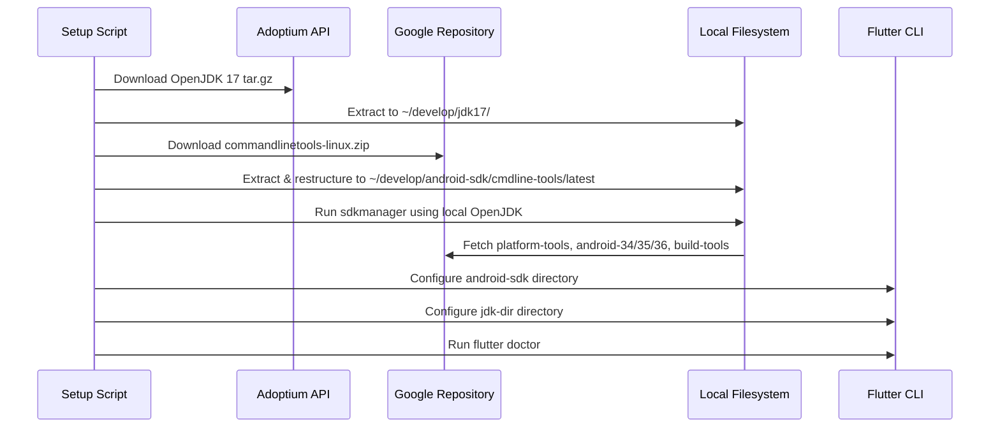

# Android Environment Setup & Troubleshooting Technical Report

This report documents the headless Android SDK and JDK setup, Flutter configuration, proxy TLS troubleshooting, and Gradle build attempts performed on the `lazy_word` repository.

---

## 1. Initial State Assessment

When we started, the development host had Flutter installed but lacked the necessary Android toolchain and Java Development Kit (JDK).

*   **Flutter Version**: `3.44.0` (Stable channel, revision `559ffa3f75`, Dart `3.12.0`).
*   **Android Toolchain Status**:
    ```text
    [✗] Android toolchain - develop for Android devices
        ✗ Unable to locate Android SDK.
    ```

---

## 2. Headless Installation & Configuration Architecture

Since the environment does not include Android Studio, we designed a local, headless setup script (`android_setup.sh`) located in the workspace to install all dependencies locally under `/home/ubuntu/develop` without requiring root/sudo privileges.

### Components Installed
1.  **JDK 17**: Eclipse Temurin OpenJDK 17 (`jdk-17.0.19+10`), which is the recommended runtime version for the modern Gradle build system used by Flutter.
2.  **Android Command Line Tools**: SDK Command-line Tools (`commandlinetools-linux-11076708_latest.zip`) unpacked into the required nested structure:
    `~/develop/android-sdk/cmdline-tools/latest/`
3.  **Android Platform & Build Tools**:
    *   `platform-tools` (adb, fastboot)
    *   Platforms: `android-34`, `android-35`, and later `android-36`
    *   Build Tools: `34.0.0`, `35.0.0`, `28.0.3`, and `36.0.0`

### Setup Pipeline Flow
The following sequence diagram outlines the local installation flow:



---

## 3. Configuration & Interactive Steps

### A. Automatic License Acceptance
The SDK tools require explicit acceptance of licenses. The setup script automated this via:
```bash
yes | sdkmanager --sdk_root=/home/ubuntu/develop/android-sdk --licenses
```
During the initial run, the task paused at the terminal prompting for acceptance of the `android-sdk-license`. We interactively fed the input (`y\n`) using background task input controls to successfully resume and complete the installation.

### B. Flutter Configuration Commands
We pointed the Flutter toolchain to our local directories:
```bash
flutter config --android-sdk /home/ubuntu/develop/android-sdk
flutter config --jdk-dir /home/ubuntu/develop/jdk17/jdk-17.0.19+10
```

This successfully updated the environment, resolving all toolchain problems. A subsequent execution of `flutter doctor` confirmed:
```text
[✓] Android toolchain - develop for Android devices (Android SDK version 36.0.0)
• No issues found!
```

---

## 4. Build Execution & Network Proxy Troubleshooting

### A. The First Build Attempt
With the SDK verified, we initiated a release APK compilation:
```bash
flutter build apk --release
```

During this build, Gradle started downloading its wrapper and toolchain requirements. However, the build failed during the artifact-downloading phase:
```text
Execution failed for task ':audio_session:generateReleaseLintModel'.
> Could not resolve com.android.tools.build:manifest-merger:31.5.2.
   > Could not get resource '...manifest-merger-31.5.2.pom'.
      > The server may not support the client's requested TLS protocol versions: (TLSv1.2, TLSv1.3).
         > Remote host terminated the handshake
```

### B. Root Cause Analysis: System Proxy TLS Handshake Failure
1.  **Diagnostic Step**: We checked the environment variables and found a local system proxy configured:
    ```bash
    https_proxy=http://127.0.0.1:7897
    http_proxy=http://127.0.0.1:7897
    all_proxy=socks://127.0.0.1:7897
    ```
2.  **Comparison Testing**:
    *   Testing *with* the proxy: `curl -I` request to Google Maven repository URLs failed with `TLS connect error` (unexpected EOF during TLS handshake).
    *   Testing *without* the proxy:
        ```bash
        env http_proxy="" https_proxy="" curl -I https://dl.google.com/dl/android/maven2/...
        ```
        This returned a successful `HTTP/2 200` response.
3.  **Conclusion**: The proxy at `127.0.0.1:7897` fails to negotiate or allow proper TLS 1.2/1.3 handshakes when JVM processes (and curl) make connections to `dl.google.com` or other Google-hosted Maven repositories.

### C. The Daemon Cache Issue
We attempted a second build with bypassed proxy variables:
```bash
env -u http_proxy -u https_proxy ... flutter build apk --release
```
This build failed with the same TLS error because Gradle runs a persistent **GradleDaemon** process. The daemon started in the first build retained the proxy environment variables in its memory.

We resolved this by stopping the daemon:
```bash
./android/gradlew --stop
```

### D. Current Status
We started a clean build with the daemon stopped and the proxy bypassed. The build successfully downloaded major files (such as NDK and CMake, expanding the SDK directory to `1.4GB`), but still reported a TLS connection failure when compiling the `just_audio` plugin on a subsequent Gradle dependency resolve. This indicates that certain underlying processes or settings (such as global system configurations) are still falling back to the local proxy.

---

## 5. Next Steps

To completely bypass the proxy and finish building the APK, we must ensure:
1.  All system proxy configurations are bypassed during compilation.
2.  Gradle-specific configuration files (`~/.gradle/gradle.properties`) are verified for proxy overrides.
3.  A clean, direct environment is forced for the build command.
